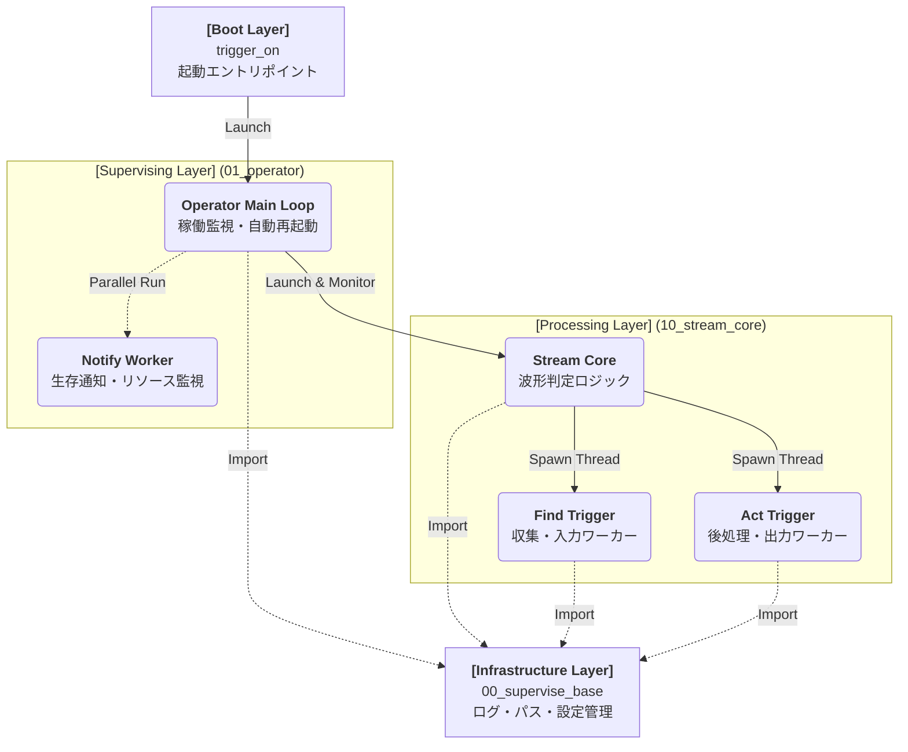
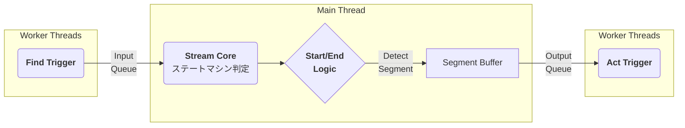

# Tri-On-Edge Stream システム全体解説

- Ver: 02.d.20260814
- By: IWATA,Y.
- Mod: ドキュメント再編

---

対象読者
- ユーザ（現場担当者・運用担当者）：1章・2章・4章
- 開発者：全章

---

上位文書
- Tri-On-Edge Concept Definition（コンセプト定義）

---

## 1. システム概要

　Tri-On-Edge Streamは、製造現場の連続データをリアルタイムに処理するストリームデータ処理フレームワーク（基盤）である。プロセス監視・自動復旧や状態管理・通知を備えた、スーパーバイザー型アーキテクチャを採用する。

### システム階層図 (Module Hierarchy)
　システムは以下の4階層で構成されており、上位が下位を呼び出す。

## 2. モジュール構成と役割

### 1. Boot Layer ── trigger_on
- 役割：システムの玄関口（BootLoader）

### 2. Infrastructure Layer ── 00_supervise_base
- 役割：システム全体の共通基盤
- ディレクトリパス・デバイス情報の一元管理
- ログ機能・ログローテーション機能の提供

  * 実行環境（.py / .exe）を判定しシステムルートを確定する
   * シングルトン的な管理: 全モジュールが参照する「ディレクトリパス（log, settings, work）」や「デバイス情報」を一元管理
   * ログ機能: 画面出力とファイル出力を統合し、ログローテーション（容量制限）機能を提供
   * このモジュールが最下層にあることで、循環参照を防ぎつつ全モジュールからフレームワーク共通機能を利用可能

### 3. Supervision Layer ── 01_operator
- 役割：現場運用のための「現場監督（Supervisor）」
- Watchdog：Stream Core のクラッシュを検知し自動再起動する
- Teams通知：CPU/メモリ/ディスクを定期監視し生存通知（Heartbeat）を送信する
- 短時間連続クラッシュ検知：一定回数以上繰り返す場合にループを停止する
   * Watchdog（番犬）機能: main_loop() 内で stream_core を呼び出します。もし stream_core が予期せぬエラーでクラッシュした場合、エラーログを記録し、自動的に 再起動（Reboot） を試みます。
   * 通知: 別スレッドでCPU/メモリ/ディスク使用量を定期監視し、Teams等で通知を送信
   * 短時間連続クラッシュ検知: 短時間に再起動が繰り返される場合、致命的な異常と判断してループを停止する安全装置

### 4. Processing Layer ── 10_stream_core
- 役割：データ処理の「脳（Processor）」
- 設定ファイルに基づき Find/Act ワーカースレッドを生成・起動
- Producer-Consumer パターンの中継点
- ErrorIF（エラー共通I/F）を初期化し、トリガーからのエラーイベントを収集・対処

入力された時系列データに対してステートマシンによる判定を実行

 * 判定ロジック:
   * prev_status (0:Wait, 1:Start, 2:Mid, 3:End) を持ち、前回の状態と今回の値によって状態遷移
   * Multi-Stage Logic: 「閾値を超えた(Stage1) AND その後3秒維持した(Stage2)」のような複合条件を cond_progress 変数で管理

 * バッファリング:
   * 波形開始(Start)から終了(End)までのデータをメモリ上の segment_buffer に蓄積し、完了と同時に act_queue へ配送

データフロー図 (Data Pipeline)

### 5. Find Trigger ── 11_find_*
- 役割：Segmentの元データを入力

実装例：
- 11_find_demo　　デモ用データ発生（乱数、CSVファイル読込み）
- 11_find_socket　TCP Socketサーバからデータ受信
- 11_find_file　　フォルダ監視・ファイル検出

### 6. Act Trigger ── 12_act_*
- 役割：Segmentのデータを後処理（出力・保存）

実装例：
- 12_act_csv　CSV保存
- 12_act_s3 　S3転送
- 12_act_viz_tk_value　リアルタイム可視化

## 3. 運用・保守ポイント

### 起動
- trigger_on を実行

### 設定変更
- 設定ファイル（JSON）を編集

設定ファイル一覧
- device_info.json 　デバイス識別情報
- error_policy.json　エラー対処ポリシー
- 01_operator.json 　通知設定、監視パラメータ
- trigger_setting_01.json　入力ソース・波形切り出し条件・カラム定義
- trigger_setting_02.json　後処理・出力先設定

### 停止方法
- Ctrl+C で協調停止
- work/run/_oneshot_stop_stream ファイルを検出することで停止（連携制御用）

以上
