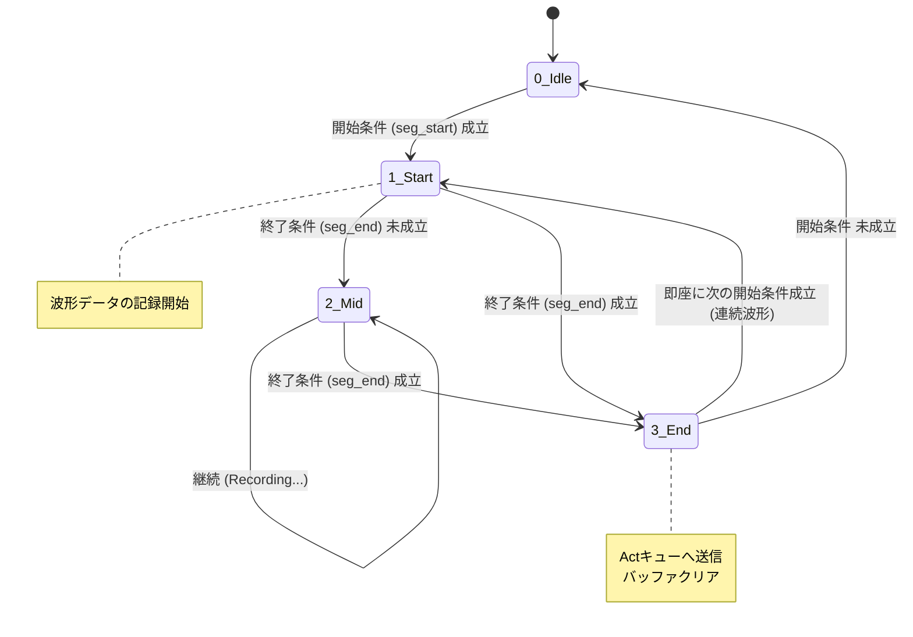

# Tri-On-Edge 波形切出しロジックと設定ガイド

- Ver: 01.c.20260814
- By: IWATA,Y.
- Mod: ドキュメント再編

---

対象読者
- ユーザ（現場担当者・運用担当者）
- 開発者

---

上位文書
- Tri-On-Edge Stream システム全体解説

---

## 1. 概要：ストリームから「意味」を切出す

　Stream Core は、絶え間なく流れてくるデータ（ストリーム）を常時監視し、特定の条件を満たした区間だけを「波形（セグメント）」として切出す。

### ステートマシン（状態遷移）の概念
波形切出しは、内部的に以下の4つの状態（Status）を遷移することで実現する。



 * 0: Idle (待機): 何も記録していない状態。「開始条件」のみを監視
 * 1: Start (開始): 波形の始まり。記録を開始します。「終了条件」の監視を開始
 * 2: Mid (記録中): 波形の途中。記録を継続しつつ、「終了条件」を監視
 * 3: End (終了): 波形の終わり。ここまでのデータを後工程（Act）へ送り、バッファをクリア


## 2. 設定ファイルの基本構造

`trigger_setting_01.json` の `monitor` セクションに記述する。

```json
"monitor": {
    "seg_start": {
        "stages": [
            {
                "op": "AND",
                "checks": [ ... ]
            }
        ]
    },
    "seg_end": {
        "stages": [ ... ]
    }
}
```

### 利用可能な判定メソッド

| メソッド名 | 説明 | threshold |
|---|---|---|
| upto | 前回値より上昇し、かつ閾値以上になった | 数値（下限） |
| downto | 前回値より下降し、かつ閾値以下になった | 数値（上限） |
| change | 前回値と値が変わった | null |
| equal | 値が閾値と等しい | 値 |
| not_equal | 値が閾値と異なる | 値 |
| diff | 前回値との差分（絶対値）が閾値以上 | 数値 |
| duration | 指定回数、ループが回った | 回数（int） |
| duration_time | ステージ開始から指定秒数が経過した | 秒数（float） |

## 3. 設定パターン集

### パターンA：シンプルな閾値

シナリオ：「電流値（列番号5）が 10.0 を超えたら開始し、5.0 を下回ったら終了する」

```json
"monitor": {
    "seg_start": {
        "stages": [{
            "op": "AND",
            "checks": [{ "method": "upto", "target_loc": 5, "threshold": 10.0 }]
        }]
    },
    "seg_end": {
        "stages": [{
            "op": "AND",
            "checks": [{ "method": "downto", "target_loc": 5, "threshold": 5.0 }]
        }]
    }
}
```

### パターンB：状態変化

シナリオ：「設備ステータス（列番号0）が変化したら開始、次の変化で終了（1変化＝1波形）」

```json
"monitor": {
    "seg_start": {
        "stages": [{
            "checks": [{ "method": "change", "target_loc": 0, "threshold": null }]
        }]
    },
    "seg_end": {
        "stages": [{
            "checks": [{ "method": "change", "target_loc": 0, "threshold": null }]
        }]
    }
}
```

## 4. 高度な機能：Multi-Stage Logic（段階的判定）

　複数のステージを定義すると、上から順番（直列）にクリアして初めて開始・終了と判定される。前のステージがクリアされると、その状態が保持され、次のステージの評価が始まる。

### パターンC：チャタリング除去（ノイズフィルタ）

シナリオ：「センサー（列番号3）が ON(1) になり、その状態が 2.0秒以上続いたら開始とみなす」

```json
"seg_start": {
    "stages": [
        {
            "##": "Stage 1: まずONになったことを検知",
            "op": "AND",
            "checks": [{ "method": "equal", "target_loc": 3, "threshold": 1 }]
        },
        {
            "##": "Stage 2: その後、2秒間待機",
            "op": "AND",
            "checks": [{ "method": "duration_time", "target_loc": 0, "threshold": 2.0 }]
        }
    ]
}
```

### パターンD：複合条件（OR）

シナリオ：「異常コード（列番号2）が 'E001' または 'E002' が出たら即座に終了」

```json
"seg_end": {
    "stages": [{
        "op": "OR",
        "checks": [
            { "method": "equal", "target_loc": 2, "threshold": "E001" },
            { "method": "equal", "target_loc": 2, "threshold": "E002" }
        ]
    }]
}
```

まとめ
| 難易度 | 用途 | 構成 |
|---|---|---|
| Basic | 単純な閾値超え | stages は1つ。checks も1つ。 |
| Parallel | 複数のトリガー条件（OR） | stages は1つ。op="OR" で checks を複数列挙。 |
| Sequential | 時間差判定・手順順守確認 | stages を複数定義（Stage1 → Stage2 → ...）。 |

まずはパターンAで動作確認し、ノイズが問題になったらパターンCを使うのを推奨

以上