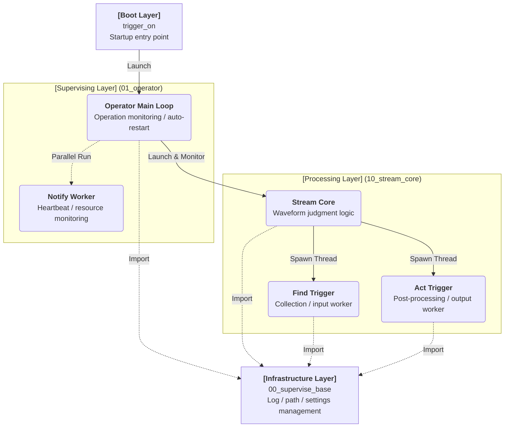
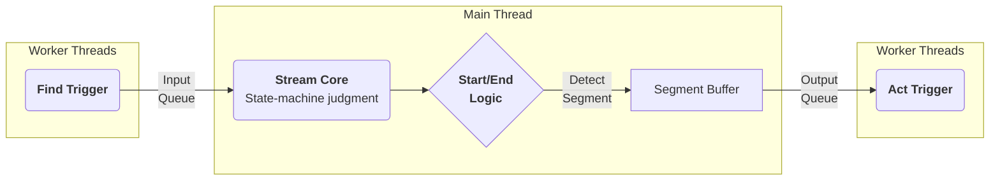

# Tri-On-Edge Stream: System Description

- Ver: 02.d.20260814
- By: IWATA,Y.
- Mod: Document restructuring

---

Target Audience
- Users (site operators / maintenance staff): Chapters 1, 2, and 4
- Developers: all chapters

---

Parent Document
- Tri-On-Edge Concept Definition

---

## 1. System Overview

　Tri-On-Edge Stream is a stream data processing framework (infrastructure) that processes continuous data from a manufacturing site in real time. It adopts a supervisor-style architecture with process monitoring, automatic recovery, state management, and notification.

### System Hierarchy Diagram (Module Hierarchy)
　The system consists of the following four layers, where each upper layer calls the layer below it.

## 2. Module Structure and Roles

### 1. Boot Layer ── trigger_on
- Role: The entry point of the system (BootLoader)

### 2. Infrastructure Layer ── 00_supervise_base
- Role: Common infrastructure for the entire system
- Centralized management of directory paths and device information
- Provides logging and log-rotation functionality

  * Determines the execution environment (.py / .exe) and resolves the system root
   * Singleton-style management: centrally manages the "directory paths (log, settings, work)" and "device information" referenced by all modules
   * Logging: unifies screen output and file output, and provides log-rotation (capacity-limiting) functionality
   * By placing this module at the lowest layer, all modules can use common framework functionality while avoiding circular references

### 3. Supervision Layer ── 01_operator
- Role: A "site supervisor" for on-site operations
- Watchdog: detects crashes in Stream Core and automatically restarts it
- Teams notifications: periodically monitors CPU/memory/disk and sends heartbeat notifications
- Short-interval repeated-crash detection: stops the loop if crashes repeat beyond a certain count
   * Watchdog function: calls stream_core within main_loop(). If stream_core crashes due to an unexpected error, the error is logged and an automatic restart (reboot) is attempted.
   * Notification: periodically monitors CPU/memory/disk usage on a separate thread and sends notifications via Teams, etc.
   * Short-interval repeated-crash detection: a safety mechanism that stops the loop when restarts repeat within a short period, treating it as a fatal condition.

### 4. Processing Layer ── 10_stream_core
- Role: The "brain" (Processor) of data processing
- Creates and launches Find/Act worker threads based on the configuration file
- Acts as the relay point of a Producer-Consumer pattern
- Initializes the ErrorIF (common error interface) and collects/handles error events from Triggers

Executes state-machine-based judgment on the incoming time-series data.

 * Judgment logic:
   * Holds prev_status (0: Wait, 1: Start, 2: Mid, 3: End) and transitions state based on the previous state and the current value
   * Multi-Stage Logic: composite conditions such as "threshold exceeded (Stage 1) AND held for 3 seconds thereafter (Stage 2)" are managed via the cond_progress variable

 * Buffering:
   * Data from the start (Start) to the end (End) of a waveform is accumulated in an in-memory segment_buffer and delivered to act_queue upon completion

Data Pipeline

### 5. Find Trigger ── 11_find_*
- Role: Feeds the source data for a Segment

Implementation examples:
- 11_find_demo　　Generates demo data (random numbers, CSV file read)
- 11_find_socket　Receives data from a TCP socket server
- 11_find_file　　Watches a folder and detects files

### 6. Act Trigger ── 12_act_*
- Role: Post-processes a Segment's data (output / save)

Implementation examples:
- 12_act_csv　Save to CSV
- 12_act_s3 　Transfer to S3
- 12_act_viz_tk_value　Real-time visualization

## 3. Operations and Maintenance Points

### Startup
- Run trigger_on

### Changing Configuration
- Edit the configuration files (JSON)

Configuration file list
- device_info.json 　Device identification information
- error_policy.json　Error-handling policy
- 01_operator.json 　Notification settings, monitoring parameters
- trigger_setting_01.json　Input source, waveform cut-out conditions, column definitions
- trigger_setting_02.json　Post-processing / output destination settings

### How to Stop
- Ctrl+C for cooperative shutdown
- Also stops when it detects the work/run/_oneshot_stop_stream file (for coordinated control)

End of document
