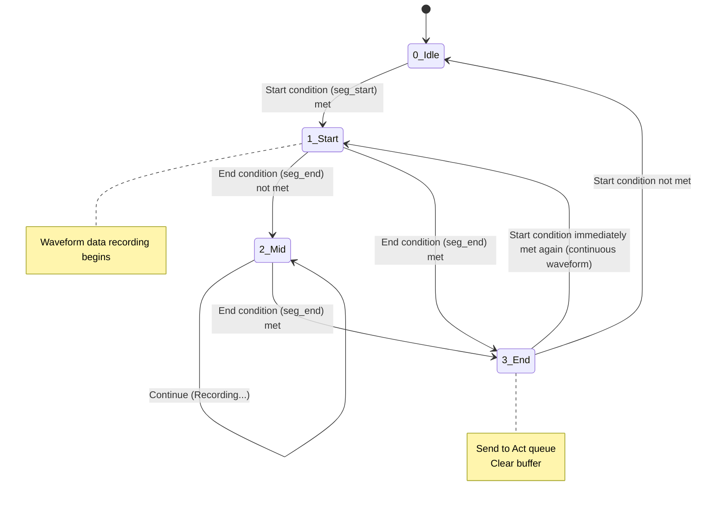

# Tri-On-Edge Waveform Cut-Out Logic and Configuration Guide

- Ver: 01.c.20260814
- By: IWATA,Y.
- Mod: Document restructuring

---

Target Audience
- Users (site operators / maintenance staff)
- Developers

---

Parent Document
- Tri-On-Edge Stream: System Description

---

## 1. Overview: Cutting "Meaning" Out of a Stream

　Stream Core continuously monitors the never-ending flow of incoming data (the stream) and cuts out only the intervals that satisfy specific conditions as a "waveform (segment)."

### The State-Machine Concept

Waveform cut-out is internally realized by transitioning through the following four states (Status).



 * 0: Idle (waiting): nothing is being recorded. Only the "start condition" is monitored.
 * 1: Start: the beginning of a waveform. Recording begins, and monitoring of the "end condition" starts.
 * 2: Mid (recording): the middle of a waveform. Recording continues while the "end condition" is monitored.
 * 3: End: the end of a waveform. Data accumulated so far is sent to the downstream process (Act), and the buffer is cleared.


## 2. Basic Structure of the Configuration File

Written in the `monitor` section of `trigger_setting_01.json`.

```json
"monitor": {
    "seg_start": {
        "stages": [
            {
                "op": "AND",
                "checks": [ ... ]
            }
        ]
    },
    "seg_end": {
        "stages": [ ... ]
    }
}
```

### Available Judgment Methods

| Method | Description | threshold |
|---|---|---|
| upto | Rose from the previous value and reached or exceeded the threshold | Numeric (lower bound) |
| downto | Fell from the previous value and reached or dropped below the threshold | Numeric (upper bound) |
| change | The value changed from the previous value | null |
| equal | The value equals the threshold | value |
| not_equal | The value differs from the threshold | value |
| diff | The absolute difference from the previous value is at least the threshold | numeric |
| duration | The loop has run the specified number of times | count (int) |
| duration_time | The specified number of seconds has elapsed since the stage began | seconds (float) |

## 3. Configuration Pattern Collection

### Pattern A: Simple Threshold

Scenario: "Start when the current value (column 5) exceeds 10.0, and end when it drops below 5.0."

```json
"monitor": {
    "seg_start": {
        "stages": [{
            "op": "AND",
            "checks": [{ "method": "upto", "target_loc": 5, "threshold": 10.0 }]
        }]
    },
    "seg_end": {
        "stages": [{
            "op": "AND",
            "checks": [{ "method": "downto", "target_loc": 5, "threshold": 5.0 }]
        }]
    }
}
```

### Pattern B: State Change

Scenario: "Start when the equipment status (column 0) changes, and end on the next change (1 change = 1 waveform)."

```json
"monitor": {
    "seg_start": {
        "stages": [{
            "checks": [{ "method": "change", "target_loc": 0, "threshold": null }]
        }]
    },
    "seg_end": {
        "stages": [{
            "checks": [{ "method": "change", "target_loc": 0, "threshold": null }]
        }]
    }
}
```

## 4. Advanced Feature: Multi-Stage Logic (Staged Judgment)

　When multiple stages are defined, they must be cleared in order from top to bottom (serially) before a start or end is judged. Once an earlier stage is cleared, that state is held while the next stage is evaluated.

### Pattern C: Debounce (Noise Filter)

Scenario: "Consider it started when the sensor (column 3) turns ON (1) and stays that way for at least 2.0 seconds."

```json
"seg_start": {
    "stages": [
        {
            "##": "Stage 1: First, detect that it turned ON",
            "op": "AND",
            "checks": [{ "method": "equal", "target_loc": 3, "threshold": 1 }]
        },
        {
            "##": "Stage 2: Then, wait 2 seconds",
            "op": "AND",
            "checks": [{ "method": "duration_time", "target_loc": 0, "threshold": 2.0 }]
        }
    ]
}
```

### Pattern D: Compound Condition (OR)

Scenario: "End immediately if the error code (column 2) is 'E001' or 'E002'."

```json
"seg_end": {
    "stages": [{
        "op": "OR",
        "checks": [
            { "method": "equal", "target_loc": 2, "threshold": "E001" },
            { "method": "equal", "target_loc": 2, "threshold": "E002" }
        ]
    }]
}
```

Summary
| Difficulty | Use Case | Structure |
|---|---|---|
| Basic | Simple threshold crossing | One stage. One check. |
| Parallel | Multiple trigger conditions (OR) | One stage; op="OR" with multiple checks listed. |
| Sequential | Time-lag judgment / procedure-compliance verification | Multiple stages defined (Stage1 → Stage2 → ...). |

Recommended approach: start by verifying operation with Pattern A, and switch to Pattern C if noise becomes a problem.

End of document
